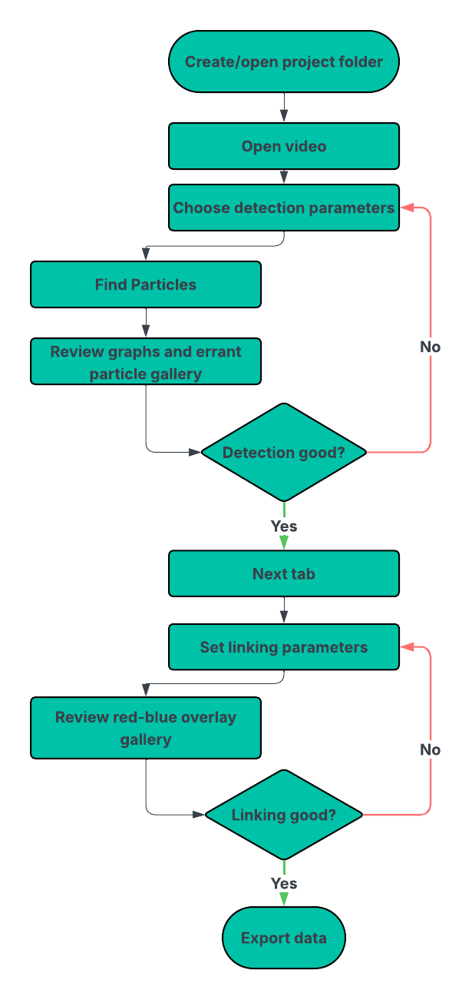

# Particle Tracking GUI

This project is a workflow facilitator for particle detection and tracking with `trackpy`. It streamlines the process from raw microscopy videos through detection, linking, review, and export, presenting parameter controls, diagnostics, and visualization galleries (including enhanced red-blue link overlays) in a single PySide6 desktop application so students can find data quickly without writing scripts.

---
## Installation
You can install the necessary dependencies using either `pip` (with a virtual environment) or `conda`.
### Option 1: pip

1.  **System Prerequisites:**
    * Python 3.10 or later
    * `ffmpeg` for video processing (e.g., on macOS: `brew install ffmpeg`)

2.  **Create & Activate Environment:**
    ```bash
    python -m venv .venv
    source .venv/bin/activate
    ```
    
3.  **Install Dependencies:**
    ```bash
    pip install --upgrade pip setuptools wheel
    pip install PySide6 trackpy opencv-python numpy pandas scipy matplotlib pims imageio pillow imageio[ffmpeg]
    ```

### Option 2: conda

1.  **Create & Activate Environment:**
    ```bash
    conda create -n particle-tracking-gui python=3.10
    conda activate particle-tracking-gui
    ```

2.  **Install Dependencies:**
    ```bash
    conda install -c conda-forge ffmpeg PySide6 trackpy opencv numpy pandas scipy matplotlib pims imageio pillow
    pip install --upgrade pip setuptools wheel
    ```

---

##  Running the Application

1.  Ensure your virtual environment or conda environment is active.
2.  Launch the GUI:
    ```bash
    python run.py
    ```
3.  Follow usage diagram:

