# Particle Tracking GUI

This project is a workflow facilitator for particle detection and tracking with `trackpy`. It streamlines the process from raw microscopy videos through detection, linking, review, and export, presenting parameter controls, diagnostics, and visualization galleries (including enhanced red-blue link overlays) in a single PySide6 desktop application so students can find data quickly without writing scripts.

---
## Installation
We recommend `conda` for managing and building the required environment for this project. Other options are possible, but the following guide is for conda setup

1. **System Prerequisites:**
    * Python 3.10 or later

2.  **Download `conda`**
    * https://www.anaconda.com/download

3.  **Create & Activate Conda Environment:**
    ```bash
    conda create -n particle-tracking-gui python=3.10
    conda activate particle-tracking-gui
    ```

4.  **Install Dependencies Into Conda Environment:**
    ```bash
    conda install -c conda-forge ffmpeg PySide6 trackpy opencv numpy pandas scipy matplotlib pims imageio pillow
    ```

---

##  Running the Application

1.  **Ensure your conda environment is active.**
    ```bash
    conda activate particle-tracking-gui
    ```
2.  **Launch the GUI:**
    ```bash
    python run.py
    ```

---

## Using the Application

1. You can create a project and set the folder where you would like the project file to be stored.

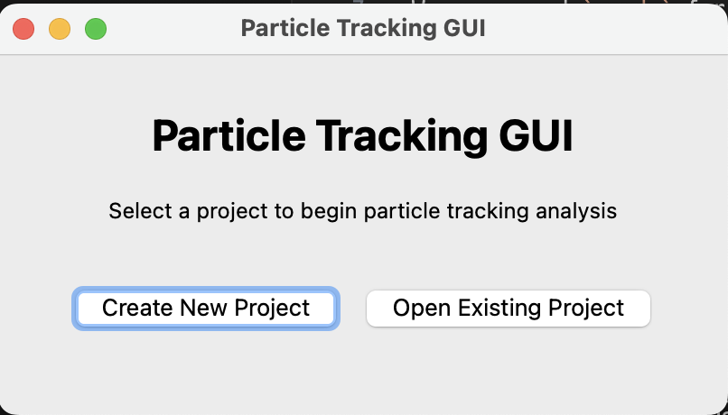

2. Selecting "Create New Project" will let you select a movie, scaling in microns/pixel and put in the project metadata

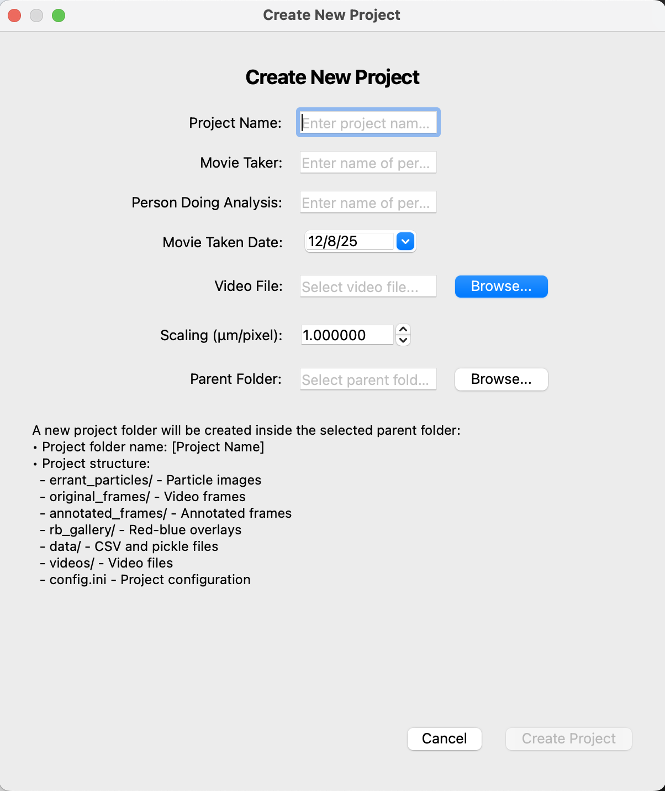

3. Selecting "Open Existing Project" will allow you to select previous project files.

4. You will now be taken into the Particle Detection Window where you have all the tools necessary to find the correct particle detection parameters. 

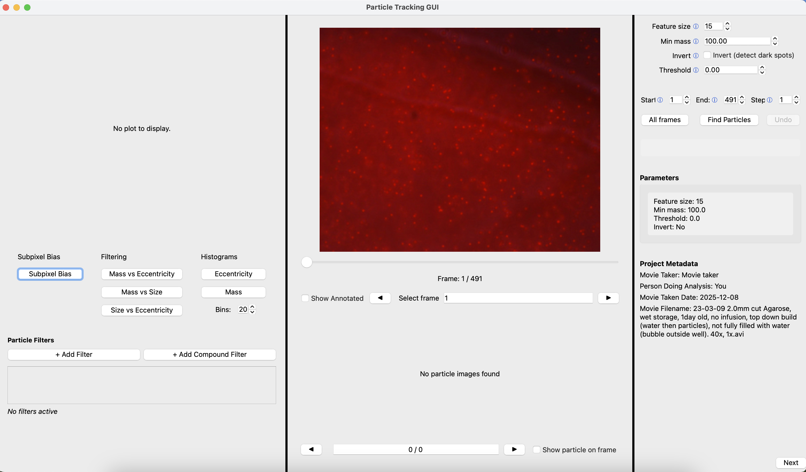

5. When it first appears you may need to resize the window in order to see things more clearly. If you click title bar at the top of the window twice in a row the window will automatically resize to fit your screen, or you can drag the bottom corners out to make it bigger. There are also black vertical lines that can reseize the indiviual columns in the window if you drag them horizontally.

6. When the window opens the video will be loaded into the frame player in the center of the screen and the project metadata will be shown in the bottom right. You can see how many frames are present and visualize the video using the slider directly beneath it. You can also jump to specific frames by inputting a frame into the "Select frame" area. The arrows on either side will of the frame input will show the next or previous frame.

7. You can now input your particle detection parameters in the top right corner. If you are unsure of what the parameters are you can hover you mouse over the blue ⓘ icon to get more information. Once you are ready to detect particles, above the project metadata, you can input which frames you would like to process. You can select the start and end frame. The step field indicates steps between the frames being analyzed (for step=2, you will count 1, 3, 5...). 

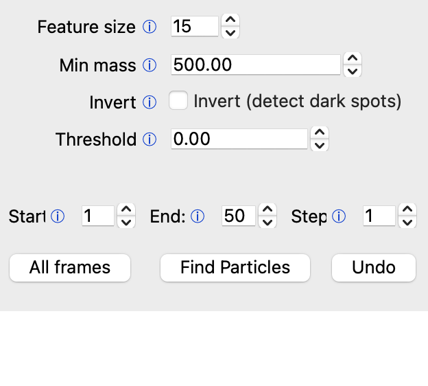

8. Clicking "Find Particles" will then analyze the given frames using the detection parameters you have inputted. It is suggested that you start finding good detection parameters with a small number of frames as finding particles can take a long time. Once you have good parameters on a small batch, you can try scaling up to include more frames.

9. Once the processing has finished you will be greeted with some more interactive fields:

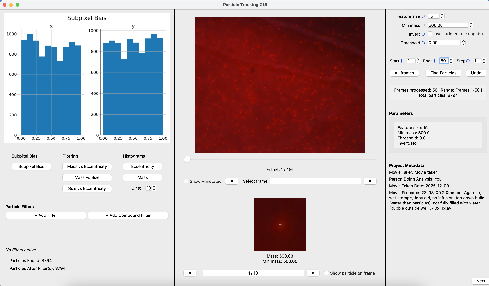

10. You can select "Show annotated" under the frame player to show the what TrackPy has identified as a particle on the frames you have processed:

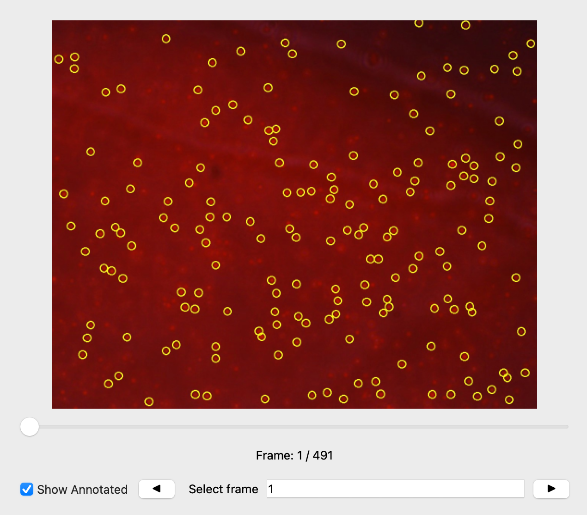

11. You will notice that below the frame player there are now images present of what we call "errant" particles, or the worst particles that TrackPy found. These are particles that are at the edges of parameter detection. For example if a particle is very close to the minmass, it will show up with information about why it was chosen. Confirming that these errant particles are actually particles and TrackPy was right to identify them as such will help to determine good detection parameters.

12. Checking "Show particle on frame" will highlight the errant particle on the video. If you scroll through the errant particles using the arrow keys, the video will jump to the frame that contains the current errant particle. 

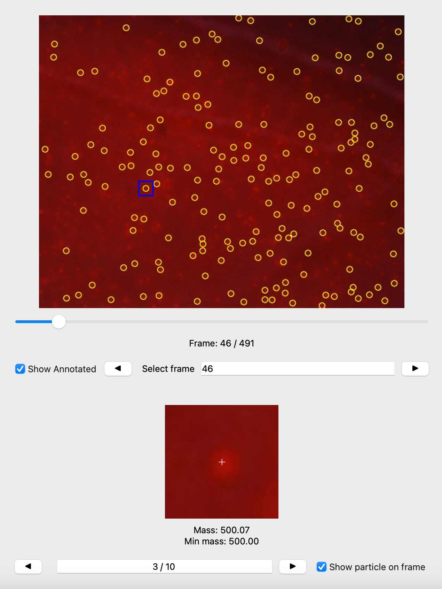

13. The plotting area on the left allows you to see helpful plots. The subpixel bias plot will automatically show up when particles are found. This is to check that the decimal part of the x and/or y positions are evenly distributed and is a good indicator of feature size. A good feature size will have a relatively flat subpixel bias, but if the feature size is too small, there willl be a dip in subpixel bias. The filtering category will plot various aspects of the particles against each other to see what should be filtered out. The histograms will plot all of the particles' mass or eccentricity to see what the majority of particles values are. The bins area controls the number of bins in the histograms. 

14. You can also easily add filters to the particles. Once you click "Add filter", you are greeted with a screen where you can set a filter. The filter you set indicates the particles YOU ARE INCLUDING, not the ones you are excluding (if you set a mass<500 filter, this will include particles with mass<500). There is also an option for compound filters which can take two parameters at once and AND, OR, or XOR the filter values together to create more complex filters. Multiple filters can be applied at the same time.

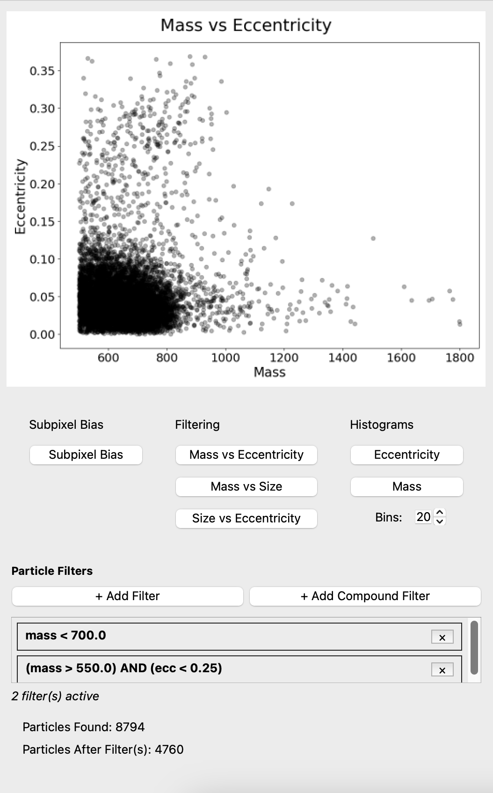

15. Once satisfied with the particle detection, you can click "Next" on the bottom right. This will take you to the Trajectory Linking Window. Note that if you try to link particles with a step value higher than 1, issues might occur because the frames are no longer consecutive. 

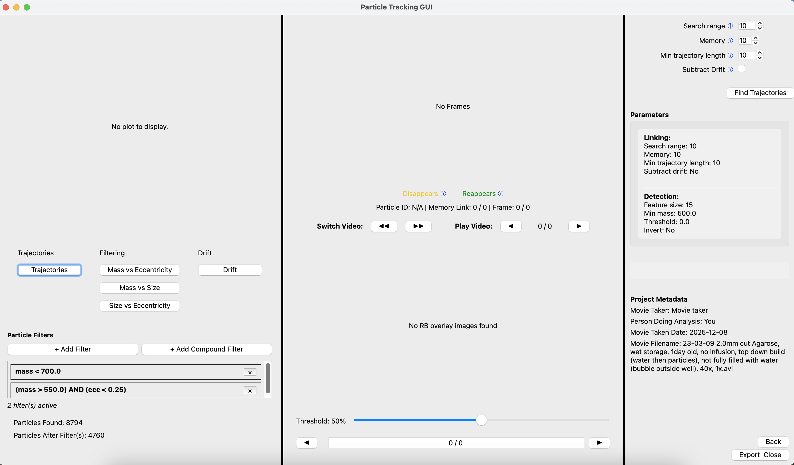

16. You can again select the trajectory parameters and click "Find Trajectories". This may take some time. 

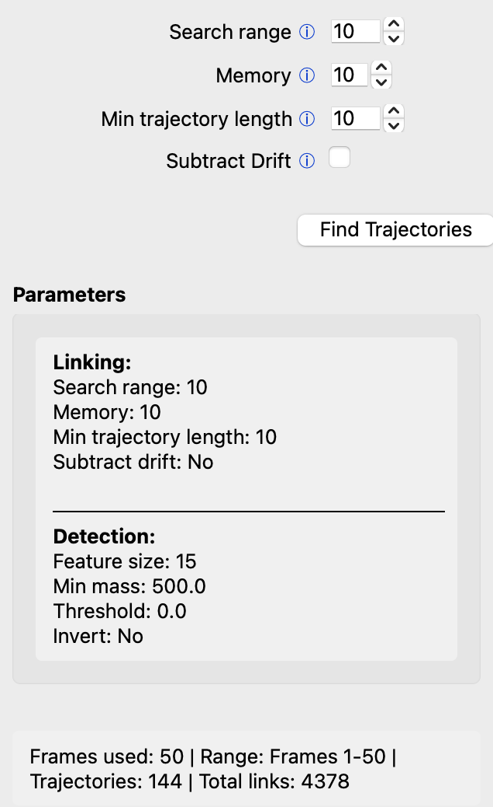

17. You can see the links where the particle disappears for the longest number of frames in the top middle. The "Play Video" single arrow buttons on the right will take you through the frames of the link with the yellow cross showing the start position and the green cross showing end position of the particle. The "Switch Video" double arrows switch between the different links. You will have 5 links shown here, with each having a few frames to show how the particle disappears. These should help to show whether TrackPy has linked the same particle or is confusing multiple particles for one.

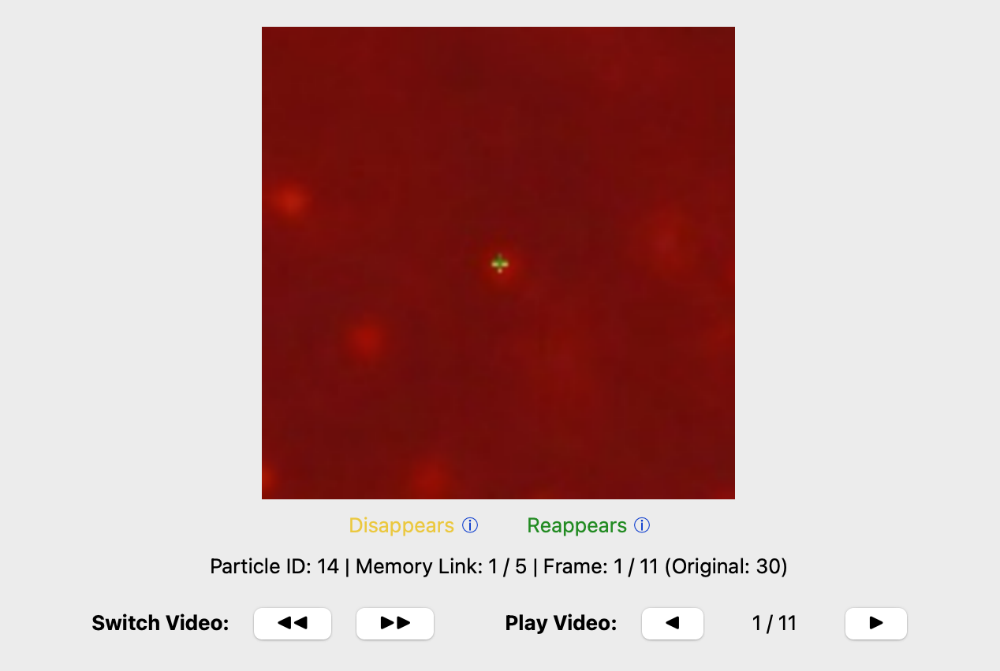

18. You can also check the links where the particle travels the most between frames in the section below. This is the red blue overlay. There is a visual representation of the red-blue overlay here: 

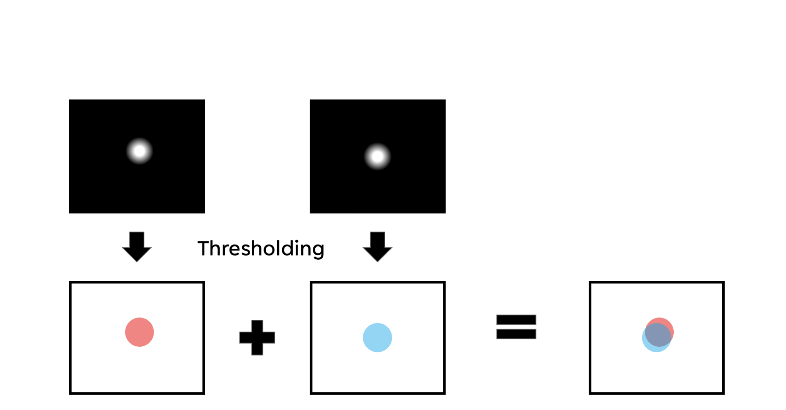

19. If you are not seeing any particles try adjusting the threshold, which determines at what values pixels will turn white or red/blue, as the best value will be different for every video and likely for every frame as well. For example, at this threshold there is not much information to gained:

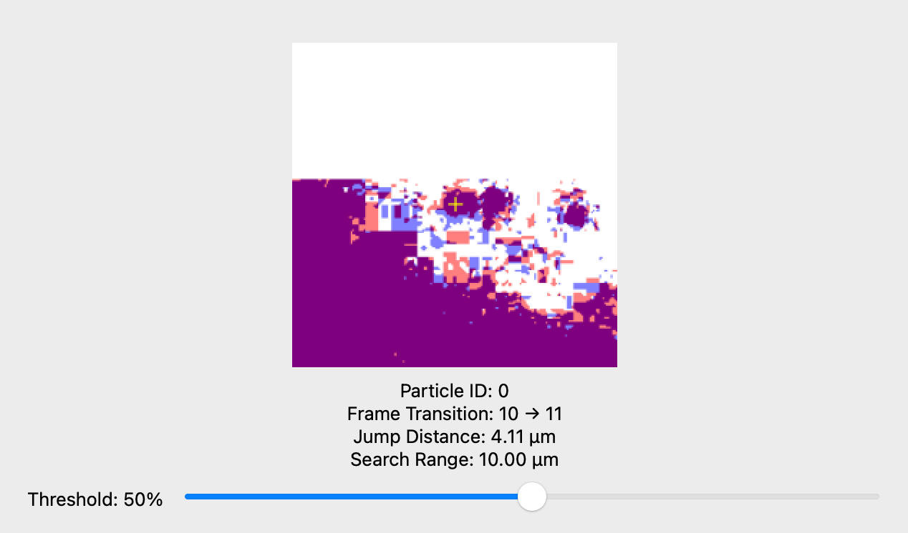

20. But at this threshold we can see that the particles overlap and are likely the same particle:

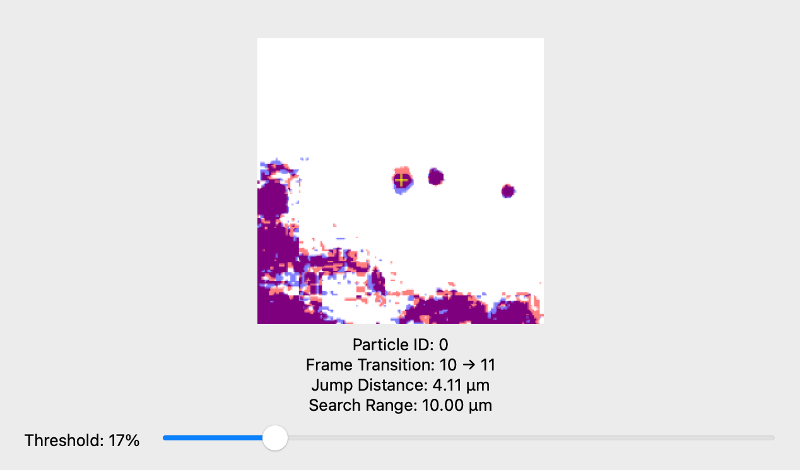

21. Similar to the Particle Detection Window, the Trajectory Linking Window has a plotting section and a filtering section. When "Find Trajectories" is pressed a plot of the particle trajectories across all frames will be plotted. This helps to visualize all of the trajectories. The drift plot calculates the overall drifting motion from all of the particles. If "Subtract Drift" in the linking parameters is checked then the drift will be subtracted from the particle positions. The same filtering plots from the Particle Detection Window are present, as some people like to filter after the trajectories have been found. The filtering section on this screen is the same as it was on the previous screen.

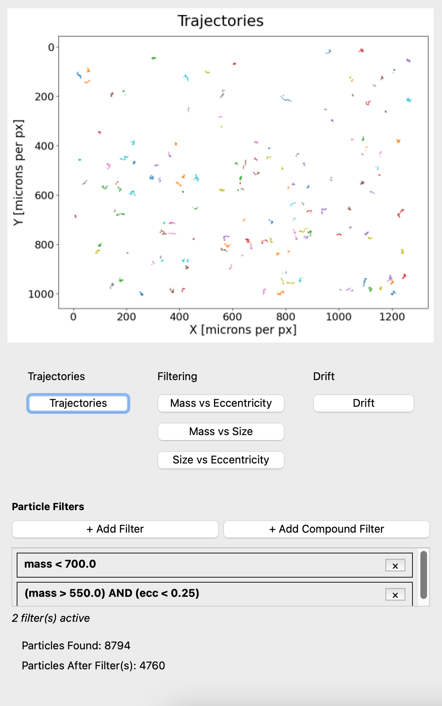

22. Once you are happy with your linked trajectories, click "Export and Close" at the bottom right to pick a place on your computer where your particle and trajectory data will be saved as both CSV and pickle files.

## Workflow Diagram

